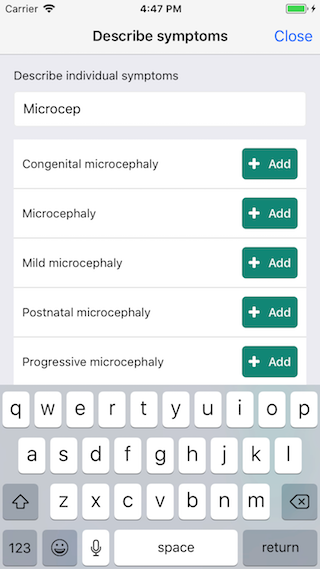
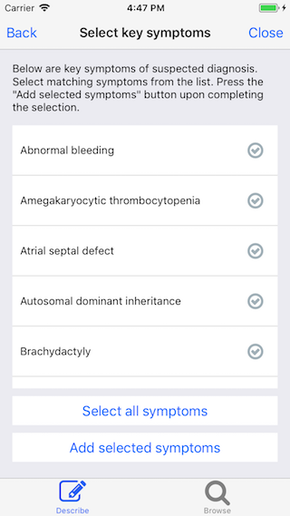
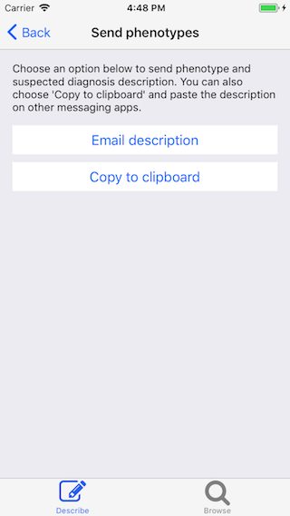
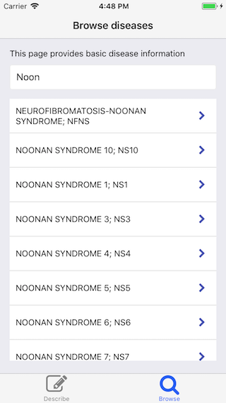
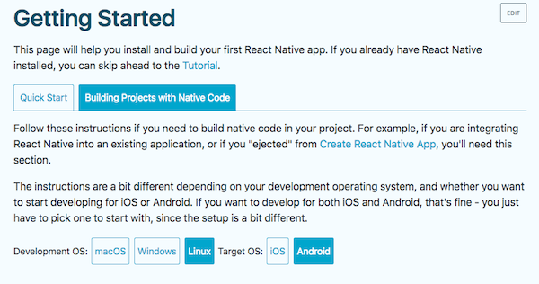

# PhenoChat

An open-source phenotyping app for mobile devices

#### Table of contents

* [About this project](#md-about-this-project)
* [Getting started](#md-getting-started)
* [Resources used](#md-resources-used)

---

## About this project
<a id="md-about-this-project"></a>

PhenoChat is an open-source phenotyping application for mobile devices. It helps users build phenotypic descriptions using medical terminologies provided by the Human Phenotype Ontology (HPO). Users can build the descriptions either by (a) specifying individual phenotype terms, or (b) specifying a disease and then selecting key phenotypic features of the disease. Upon completion, the descriptions can be sent by email or copied to clipboard for pasting in other messaging applications. The descriptions are formatted in a way that can be automatically parsed.

This project is built using React Native.

### Screenshots

#### Main screen


#### Build phenotypic description by specifying individual phenotype terms.


#### Build phenotypic description by specifying a disease and then selecting key phenotypic features of the disease.



#### Send description by email or copy description to clipboard


#### Browse diseases



### Formatted phenotype description example

Note: "##" marks the header of a file. Phenotypes are listed under `##phenotypes`. Diseases are listed under `##suspected_diagnoses`.

```
##phenochat_description
##phenotypes
##format=hpo_id,hpo_name
HP:0031053,Coarctation in the transverse aortic arch
HP:0000930,Elevated imprint of the transverse
##suspected_diagnoses
##format=MIM_number,OMIM_name
101900,Acrokeratosis verruciformis
```


## Getting started
<a id="md-getting-started"></a>

1. Install prerequisites

	Please follow the instructions provided under ["Prerequisites"](#md-prerequisites)

2. Clone the repository to your local machine

	```
	git clone git@github.com:jes8/phenochat.git
	```

3. Install dependencies

	```
	yarn install
	```

4. Start developing!

	To run this project on devices/simulators, please follow the instructions provided under ["Testing"](#md-testing).


## Prerequisites
<a id="md-prerequisites"></a>

This project requires:

	- React Native
	- Node.js
	- Xcode (macOS only)
	- Java SE Development Kit (JDK)
	- Android Studio
	- Node.js packages (rnpm and node-xcode)
	- Yarn

Below explains how to install the prerequisites.

### React Native, Node.js
Node.js is a prerequisite of React Native. Therefore, it is highly recommended that Node.js is installed according to React Native's instructions. Follow below instructions to access relevant sections within the React Native Document.

#### macOS
Please follow instructions provided by [React Native](https://facebook.github.io/react-native/docs/getting-started.html), under 'Building Projects with Native Code', with 'macOS' selected as Development OS and 'iOS' selected as Target OS (see screenshot below).


#### Linux
Please follow instructions provided by [React Native](https://facebook.github.io/react-native/docs/getting-started.html), under 'Building Projects with Native Code', with 'Linux' selected as Development OS and 'Android' selected as Target OS (see screenshot below).



#### Windows
Please follow instructions provided by [React Native](https://facebook.github.io/react-native/docs/getting-started.html), under 'Building Projects with Native Code', with 'Windows' selected as Development OS and 'Android' selected as Target OS (see screenshot below).


### Xcode (macOS only)
Xcode is only for macOS users wishing to develop iOS apps. React Native also requires Xcode Command Line Tools. Therefore, please follow instructions given by [React Native](https://facebook.github.io/react-native/docs/getting-started.html), under 'Building Projects with Native Code', with 'macOS' selected as Development OS and 'iOS' selected as Target OS (see screenshot below).


### Java SE Development Kit (JDK)
Download JDK 8 or newer at [Java website](http://www.oracle.com/technetwork/java/javase/downloads/jdk8-downloads-2133151.html).

Note: JDK is a prerequisite of React Native. Therefore, React Native also provides instructions for downloading JDK under 'Building Projects with Native Code', with 'Android' selected as Target OS. ([React Native Document website](https://facebook.github.io/react-native/docs/getting-started.html)).

### Android Studio
Android Studio is for those wishing to develop Android apps. Please follow instructions given by [React Native](https://facebook.github.io/react-native/docs/getting-started.html), under 'Building Projects with Native Code', with your OS selected as Development OS and 'Android' selected as Target OS (see screenshot below).


### Node.js packages (rnpm and node-xcode)
Node.js must be installed before proceeding to this step!

npm packages rnpm and node-xcode are required by react-native-sqlite-storage. (For more information, please see the github repository of [react-native-sqlite-storage](https://github.com/andpor/react-native-sqlite-storage))

To install, run below
```
npm -g install rnpm xcode
```

### yarn
This project uses Yarn for managing dependencies. Please install Yarn by following their [installation document](https://yarnpkg.com/lang/en/docs/install/#mac-stable).


## Testing
<a id="md-testing"></a>

### iOS simulator

To run on iOS simulator:

```
# Check list of available devices in Xcode or run below cmd
xcrun simctl list devices

# Run on simulator
react-native run-ios --simulator="iPhone 6"
```

### iOS device

Do so in Xcode but will need apple dev account (for more details, refer to [React Native doc](https://facebook.github.io/react-native/docs/running-on-device.html))

### Android emulator

To run on Android emulator, start the emulator by running:

```
# Start emulator (macOS)
/Users/<home>/Library/Android/sdk/tools/emulator -avd Nexus_5X_API_23
```

Then run on emulator

```
# Make sure emulator can be seen in adb
adb devices

# And run
react-native run-android
```

### Android device

To run on android device, make sure device can be seen in adb devices (might need to enable USB debugging option in android Settings > System > Developer options)

(For more details, refer to [React Native doc](https://facebook.github.io/react-native/docs/running-on-device.html))

```
# Make sure device can be seen in adb
adb devices

# And run
react-native run-android
```


## Resources used
<a id="md-resources-used"></a>

1. Human Phenotype Ontology (HPO) (for phenotype terms and synonyms) [link](https://hpo.jax.org/)

2. Online Mendelian Inheritance in Man (OMIM) API (disease names and synonyms) [link](https://www.omim.org/)

